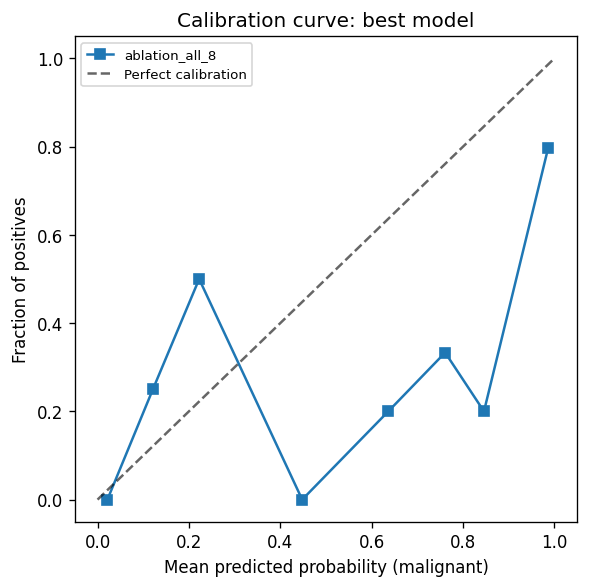

# Liver lesion benign/malignant classification from multi-phase MRI

A self-contained reproducible proof-of-concept for binary classification of liver lesions
from multi-phase MRI, with a phase-ablation study as the central scientific deliverable.

---

## Summary

This is a proof-of-concept study of benign versus malignant liver lesion classification from multi-phase MRI, using the LLD-MMRI-MedSAM2 dataset (498 patients, 7 lesion classes, 8 phases per patient). The central question is which phases carry the diagnostic signal, asked without assuming the answer in advance. Twelve configurations were evaluated (four ablation sets and eight single-phase models), each using a shared-encoder 3D CNN on lesion ROI crops, patient-level stratified splits, and 1 000-resample bootstrap CIs. The four dynamic contrast phases match the full eight-phase model at AUROC 0.838 and have better calibration (ECE 0.119 vs 0.202); the remaining phases add no measurable benefit at this sample size. Arterial phase alone ranks among the weakest single phases, consistent with the pooled malignant label (HCC, ICC, and metastasis): arterial hyperenhancement is specific to HCC, whereas delayed and venous washout is shared across all three classes. Predicted probabilities are miscalibrated (ECE 0.202 for the 8-phase model) and are not suitable for risk communication without recalibration. The project was built over four evenings as a self-directed exercise ahead of a research assistant application; development was assisted by Claude Code, and all design decisions and interpretation are my own.

---

## Clinical framing

Dynamic contrast-enhanced MRI is the primary non-invasive tool for liver lesion characterisation.
The canonical HCC signature (arterial-phase hyperenhancement followed by venous or delayed washout)
underpins current LI-RADS and EASL criteria.
This project asks two related questions: how much classification signal lives in the full eight-phase protocol, and which phases contribute most. Neither answer is assumed in advance.

---

## Data provenance

**Dataset:** LLD-MMRI-MedSAM2 (Lou et al., *Neural Networks* 2025; MedSAM2 annotations, Ma et al. arXiv:2504.03600).
Hosted on [Hugging Face](https://huggingface.co/datasets/wanglab/LLD-MMRI-MedSAM2). Licence: CC BY-NC 4.0.
Data are not redistributed here; download via `bash scripts/download_data.sh`.

- 498 patients, 8 MRI phases each, 3 984 NIfTI volumes total.
- 7 lesion classes: hemangioma (n=79), ICC (n=58), abscess (n=54), metastasis (n=51),
  cyst (n=53), FNH (n=46), HCC (n=157).
- Binary: benign = 232 patients, malignant = 266 patients.
- Segmentation masks are MedSAM2-generated (model-assisted, human-in-the-loop). They are used
  **only for ROI cropping**, not as ground-truth for evaluation.
- Single-centre Chinese cohort (Zhongshan Hospital); findings may not generalise directly.

**Splits:** No official split exists in the annotation JSON (verified).
Stratified patient-level split constructed with seed 42 (target approx. 316 / 78 / 104 train/val/test);
exact counts in `reports/split_report.json`.

---

## Methods

| Component | Choice | Rationale |
|-----------|--------|-----------|
| ROI crop | Mask bbox + 20 % margin, resampled to 32 x 64 x 64, bilinear | Lesion = 0.1 % of full-abdomen volume |
| Normalisation | Per-sample z-score | Avoids intensity range assumptions across phases |
| Model | Shared-weight 4-block 3D CNN (~1.7 M params) | Simple, auditable; encoder applied once per phase |
| Fusion | Late (concatenate phase features before head) | Enables per-phase attribution |
| Loss | Class-weighted cross-entropy | Mild malignant/benign imbalance (266/232) |
| Optimiser | AdamW, lr=1e-3, wd=0.01 | Standard |
| Training | 60 epochs max, early stopping patience 10 (val AUROC), AMP on CUDA | |
| Seed | 42 (Python / NumPy / PyTorch) | Deterministic |

Augmentation (train only): random axis flips, +-2-voxel translation, +-10 % intensity scale/shift.

---

## Results

### Phase ablation: Experiment A (headline)

Bootstrap CIs are 1 000-resample patient-level, seed 42.
Numbers are read directly from `reports/results_summary.csv`.

| Phase set | n phases | AUROC (95 % CI) | AUPRC (95 % CI) | Sens | Spec |
|-----------|----------|-----------------|-----------------|------|------|
| T2WI + DWI | 2 | 0.722 [0.614-0.826] | 0.703 [0.582-0.827] | 0.929 | 0.551 |
| C-pre + C+A | 2 | 0.703 [0.597-0.798] | 0.744 [0.616-0.849] | 0.536 | 0.837 |
| Contrast 4-phase | 4 | 0.838 [0.761-0.907] | 0.860 [0.773-0.929] | 0.804 | 0.735 |
| **All 8 phases** | **8** | 0.838 [0.753-0.914] | 0.821 [0.715-0.917] | 0.911 | 0.735 |

### Per-phase: Experiment B (secondary)

| Phase | AUROC (95 % CI) |
|-------|-----------------|
| C-pre | 0.669 [0.560-0.769] |
| C+A (arterial) | 0.673 [0.564-0.767] |
| C+V (venous) | 0.776 [0.681-0.865] |
| C+Delay | 0.787 [0.694-0.868] |
| T2WI | 0.701 [0.589-0.803] |
| DWI | 0.629 [0.523-0.736] |
| InPhase | 0.778 [0.685-0.863] |
| OutPhase | 0.707 [0.595-0.807] |

### Calibration (8-phase model)



ECE: 0.202 (8-phase model, shown); 0.119 (4-phase model).

### Interpretation

**Headline.** The four dynamic contrast phases (C-pre, C+A, C+V, C+Delay) account for essentially all the discriminative signal in this dataset. The 8-phase and 4-phase contrast models reach identical AUROC (0.838). The 4-phase model has better AUPRC and ECE (0.12 vs 0.20). The four additional sequences (T2WI, DWI, InPhase, OutPhase) confer no measurable benefit at this sample size.

**Per-phase pattern.** In single-phase ablations, delayed (C+Delay) and venous (C+V) phases rank among the strongest, while arterial alone (C+A) is among the weakest. This pattern is consistent with the pooled malignant class composition: HCC, ICC, and metastasis are all labelled malignant. Arterial hyperenhancement is a signature of HCC (the basis of LI-RADS criteria) but is not characteristic of ICC or metastasis. Delayed and venous phases capture washout, a feature shared more broadly across the pooled malignant classes. A classifier trained on the pooled label therefore extracts less discriminating information from arterial phase alone than from washout-phase images.

**Calibration.** ECE is 0.20 (8-phase) and 0.12 (4-phase). Both models are miscalibrated. Predicted probabilities are not suitable for risk communication without recalibration (e.g. isotonic regression or Platt scaling fitted on a dedicated calibration set).

**Caveats.** Bootstrap 95% CIs overlap across most comparisons. No formal significance testing was performed. Trends are described as observations, not established differences. The val-to-test AUROC gap reflects expected selection optimism from early stopping on validation AUROC.

### Grad-CAM and failure cases

Axial-slice montages were generated from the 8-phase model (`outputs/runs/ablation_all_8`) on six test cases. Four are correctly classified (MR104842, MR107127, MR109260, MR117743) and two are misclassified (MR113033, MR130096). Montage PNGs are in `reports/figures/`; per-case Grad-CAM observations are in `reports/failure_analysis.md`.

---

## Limitations

- **Single-centre Chinese cohort** (acquisition details in Lou et al. 2025): ethnic, scanner, and protocol diversity not represented.
- **ROI cropping presupposes detection**: the pipeline starts from MedSAM2-generated masks. In clinical reality, lesions must first be found.
- **Per-phase ROI extraction, no cross-phase voxel registration**: bounding boxes are computed from each phase's own segmentation mask independently. No cross-phase voxel registration is performed; multi-lesion correspondence is by lesion identity (same patient, same annotation) not by voxel alignment.
- **One random seed**: results should be confirmed across multiple seeds before drawing quantitative conclusions.
- **No radiologist review**: model errors are characterised post-hoc from predictions, not from expert re-reads.
- **MedSAM2 masks are model-generated** (human-in-the-loop but not fully manual): mask quality directly affects crop quality.
- **DWI native resolution**: DWI volumes are 256 x 256 x 24 (vs 512 x 512 x 72 for other phases). After ROI crop and resample to 32 x 64 x 64, the DWI crop covers a smaller physical footprint. This affects crop quality relative to other phases.

---

## What this would become with two years and a clinical dataset

- Whole-liver weakly-supervised detection (MIL) to remove the detection-presupposed bottleneck.
- Cross-phase and CT-MRI registration for genuine multi-modal fusion.
- Fusion with report-derived longitudinal features (prior imaging, AFP trajectory).
- Multi-centre validation and prospective calibration.

---

## Reproduce

```bash
# Build and smoke-test (CPU, under 5 min)
docker build -t liver-lesion-poc .
docker run --rm -v $(pwd)/LLD-MMRI-MedSAM2:/workspace/LLD-MMRI-MedSAM2 \
    liver-lesion-poc bash scripts/smoke_test.sh

# Without Docker
pip install -r requirements.txt
bash scripts/smoke_test.sh

# Full training (GPU recommended, see run_experiments.ipynb)
bash scripts/run_train.sh configs/ablation_all_8.yaml
bash scripts/run_eval.sh
```

**Hardware and wall-clock (RTX 4060 Laptop GPU, 8 GB VRAM):**
- Cache build (3 984 volumes): approx. 45 min (CPU-bound; machine-dependent)
- Full 12-config training suite (`bash scripts/run_all_gpu.sh`): approx. 15 min
- Evaluation (bootstrap CIs, calibration, Grad-CAM): approx. 2 min

---

## Citation

```bibtex
@article{LLD-MMRI,
  title={Sdr-former: A siamese dual-resolution transformer for liver lesion classification using 3d multi-phase imaging},
  author={Lou, Meng and Ying, Hanning and Liu, Xiaoqing and Zhou, Hong-Yu and Zhang, Yuqin and Yu, Yizhou},
  journal={Neural Networks}, pages={107228}, year={2025}
}
@article{MedSAM2,
  title={MedSAM2: Segment Anything in 3D Medical Images and Videos},
  author={Ma, Jun and others},
  journal={arXiv preprint arXiv:2504.03600}, year={2025}
}
```
